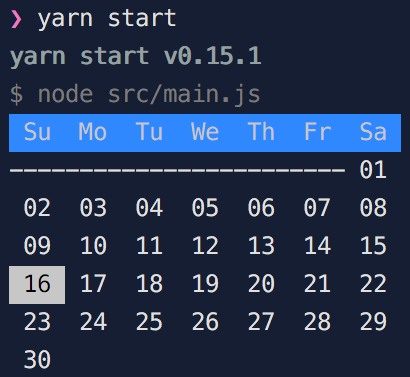

# :calendar: day-off

## Build
1. Install [Node.js](http://nodejs.org/)
2. Clone the repository `git clone https://github.com/remunizz/day-off.git`
3. Run `cd day-off`
4. Run `npm install && npm start` 

Made with :heart: by [remunizz](https://github.com/remunizz) and [contributors](https://github.com/remunizz/day-off/graphs/contributors).
